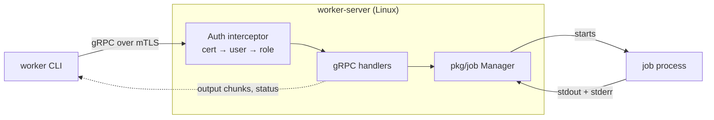
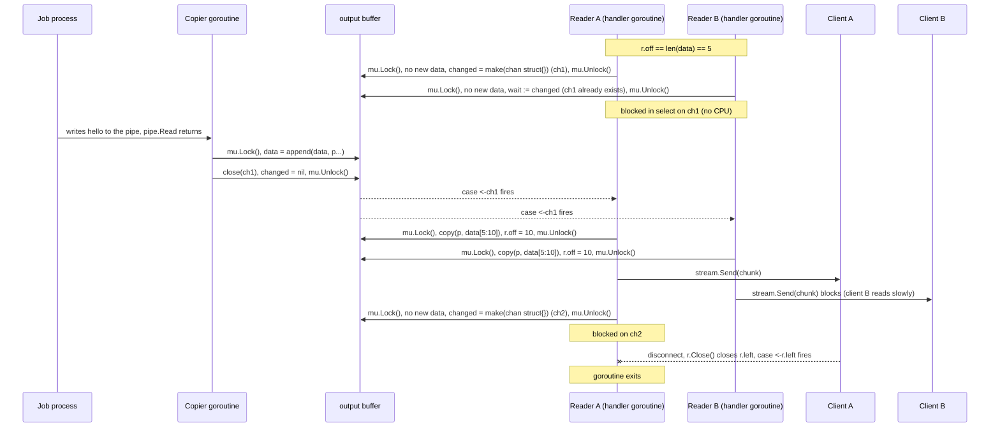

# Job Worker Design

## What

A service that runs Linux processes ("jobs") for remote users. There are three
parts:

1. **Library** (`pkg/job`): start, stop, get the status of, and stream the output of jobs.
2. **Server** (`worker-server`): a gRPC API over mTLS that wraps the library and checks who is allowed to do what.
3. **CLI** (`worker`): a command-line client for the server.

## Scope

This design targets **Level 4**. The goal is the simplest design that meets the
requirements.

**In scope**
- Start, stop and get the status of a job.
- Stream a job's output from its first byte, to many clients at once, without
  polling, for any kind of data (text or binary).
- A gRPC API with mTLS and a simple authorization scheme.
- A CLI for all of the above.

**Out of scope** (TODOs in code)
- cgroups resource limits and guaranteed cleanup of all child processes (Level 5).
- Persistence: jobs and output live in memory and are lost when the server restarts.
- Limits: on output size, number of jobs, and how long finished jobs are kept.
- Configuration: addresses, certificate paths and timeouts are hardcoded.
- Extra API surface: no job listing and no stdin. Clients keep the ID that
  `StartJob` returns.
- High availability: see [Future work](#future-work).

**Assumptions**
- The server runs on 64-bit Linux as a normal (non-root) user. Jobs run on the
  same machine as child processes of the server.
- The CLI can run anywhere that can reach the server.

## Architecture



- The **server** handles mTLS, works out the user from the client certificate,
  and checks permissions.
- The **library** handles processes and output. It doesn't need to know anything about gRPC or
  TLS. It stores the job owner as a plain label for the server to check.

## Library

### API

```go
type Manager struct{ /* ... */ }

func NewManager() *Manager
func (m *Manager) Start(owner, command string, args []string) (Status, error)
func (m *Manager) Stop(ctx context.Context, id string) (Status, error)
func (m *Manager) Status(id string) (Status, error)
func (m *Manager) Output(id string) (io.ReadCloser, error) // starts at the first byte; Read blocks until more output or io.EOF
func (m *Manager) Close() error                             // kills all jobs on shutdown

type Status struct {
	ID, Owner, Command string
	Args               []string
	State              State // Running, Exited, Stopped
	ExitCode           *int  // nil while running; -1 if killed by a signal
}
```

Job IDs are random strings generated with `crypto/rand`.

### How to Run the job?

- The server runs the command directly with `exec.Command(command, args...)`.
  **No shell is involved**, so arguments are passed exactly as given. Users who
  want pipes or globs can run `bash -c "..."` as the job itself.
- **stdout and stderr are both written to one pipe**, so the output is in the
  same order a terminal would show. The trade-off is that clients can't tell
  stdout from stderr.
- The job gets **no stdin** and **a minimal environment** (only `PATH`, so it
  can't read server secrets).
- If the executable doesn't exist, `Start` returns an error and no job is created.

Each job has two goroutines. One copies output from the pipe into the job's
buffer. The other waits for the process to exit, records its exit code, then
drains and closes the pipe.

### Job states

```
1. RUNNING // command in progress
2. EXITED  // process exits by itself
3. STOPPED // user requested to stop

RUNNING --(process exits by itself)--> EXITED
RUNNING --(Stop requested)-----------> STOPPED
```

### How to Stop the job?

- Stop kills the job process with `cmd.Process.Kill()` (`SIGKILL`), then waits
  for it to exit and returns the final status.
- Stopping a job that has already finished just returns its status, so retries
  are safe.
- **Children are not terminated.** They keep running, but they can no longer
  affect the job: the stream ends when the job process exits (see
  [Output streaming](#output-streaming)). Guaranteed cleanup of children needs
  cgroups, which is out of scope for L4.
- Trade-off: `SIGKILL` gives the job no chance to clean up. TODO: send `SIGTERM`
  first and use `SIGKILL` only after a grace period.

### Output streaming

Each job keeps **all of its output in one in-memory
buffer that only ever grows**. Readers never remove data from it.

```go
type output struct {
	mu      sync.Mutex
	data    []byte        // all output so far
	done    bool          // no more output will arrive
	changed chan struct{} // nil unless a reader is waiting; closed to wake them
}
```

- **Writing:** the copier goroutine appends to `data`, then closes `changed` and
  sets it back to nil, but only if a reader created one. **A job with no readers
  allocates no channels**, so it makes no channel garbage for the GC to collect.
- **Reading:** each client keeps its own position in the buffer.
  - If there is data past its position, it gets that data.
  - If the output is finished, it gets `io.EOF`.
  - Otherwise it creates `changed` under the lock if it is nil, then sleeps on
    that channel until new output arrives, **so there is no polling or
    busy-waiting**.
- **Ending the stream:** when the job process exits, the server drains whatever
  is still in the pipe (using a short read deadline) and then closes its own read
  end. The copier's `Read` returns, the buffer is marked done, and every reader
  gets `io.EOF`. **The stream therefore ends when the job exits**, even if a
  child still holds the write end of the pipe; `exec.Cmd.WaitDelay` does the same
  for pipes Go creates itself. Anything a surviving child writes after the job
  exits is dropped: the job is finished and its status is final.

Example: two clients stream the same job, and the job prints `hello`.



The requirements follow directly:

| Requirement | How |
| --- | --- |
| No polling | Readers sleep on a channel and are woken when new output arrives. |
| From the start | Every reader starts at position 0 of a buffer that is never trimmed. |
| Many clients | Each reader has its own position; the buffer is shared. |
| Binary-safe | Bytes are copied exactly as written; nothing is parsed. |

Slow clients don't slow down the job or other clients, because the writer never
waits for readers. When a client disconnects, its reader is closed, which wakes
it and ends its goroutine.

## API

```protobuf
syntax = "proto3";
package jobworker.v1;

service JobWorker {
  rpc StartJob(StartJobRequest) returns (StartJobResponse);
  rpc StopJob(StopJobRequest) returns (StopJobResponse);
  rpc GetJobStatus(GetJobStatusRequest) returns (GetJobStatusResponse);
  // Streams output from the first byte. Ends when the job exits.
  rpc StreamJobOutput(StreamJobOutputRequest) returns (stream StreamJobOutputResponse);
}

// Each RPC has its own request and response so they can change independently.
message StartJobRequest {
  string command = 1;
  repeated string args = 2;
}
message StartJobResponse { JobStatus status = 1; }

message StopJobRequest { string job_id = 1; }
message StopJobResponse { JobStatus status = 1; }

message GetJobStatusRequest { string job_id = 1; }
message GetJobStatusResponse { JobStatus status = 1; }

message StreamJobOutputRequest { string job_id = 1; }
message StreamJobOutputResponse {
  bytes data = 1; // raw bytes, binary safe, up to 32 KiB per message
}

enum JobState {
  JOB_STATE_UNSPECIFIED = 0;
  JOB_STATE_RUNNING = 1;
  JOB_STATE_EXITED = 2;
  JOB_STATE_STOPPED = 3;
}

message JobStatus {
  string job_id = 1;
  string owner = 2;
  string command = 3;
  repeated string args = 4;
  JobState state = 5;
  // Absent while the job is running. Set once it reaches EXITED or STOPPED;
  // -1 if the process was terminated by a signal.
  optional int32 exit_code = 6;
}
```

**Errors**

| Condition | gRPC code |
| --- | --- |
| Empty command or job ID, executable not found | `InvalidArgument` |
| Unknown job ID, or another user's job | `NotFound` |
| Valid certificate but unknown user | `PermissionDenied` |
| Anything unexpected | `Internal` (details are logged, not returned) |

Another user's job returns `NotFound` rather than `PermissionDenied`, so users
can't discover which job IDs exist.

## Security

### mTLS

Both sides prove who they are with certificates signed by our CA:

| Direction | How |
| --- | --- |
| Client verifies server | The client trusts only our CA (not the system's trusted certificates) and checks that the server certificate matches the hostname and is marked for server use. |
| Server verifies client | The server uses `ClientAuth: tls.RequireAndVerifyClientCert` with our CA. A connection without a valid client certificate marked for client use fails during the handshake, before any request is handled. |

- **TLS 1.3 only.** It removes old, weak options such as CBC ciphers and RSA key
  exchange.
- **Cipher suites:** Go doesn't let you choose TLS 1.3 cipher suites, and all of
  its built-in ones are strong (AES-GCM and ChaCha20-Poly1305).
- **mTLS is the only authentication.** No tokens or passwords are layered on top.

### Certificates

- One CA signs the server certificate and all client certificates.
- **ECDSA P-256 keys** with SHA-256 signatures: strong, small and fast. The CA
  is valid for 1 year, the server and client certificates for 90 days.
- **Separate usages:** a server certificate can't be used as a client
  certificate, and the other way round.
- **The server certificate** is only valid for `localhost` and `127.0.0.1`.
- **Dev certificates are generated once and committed** under `certs/` so the
  demo works out of the box. Tests generate their own certificates, so they
  never break when committed ones expire. TODO: use short-lived certificates
  from a real CA, and never commit keys.

### Authentication

The user is the **Common Name (CN)** of the verified client certificate. A gRPC
interceptor reads it on every call. Requests from certificates with no CN are
rejected.

### Authorization

The server has a hardcoded table mapping users to roles:

| User | Role | Can access |
| --- | --- | --- |
| `jimmy` | admin | all jobs |
| `jimbob` | user | only jobs they started |

A certificate signed by our CA whose user isn't in the table is rejected.
Roles live on the server rather than in the certificate, so they can change
without issuing new certificates. TODO: ideally roles should be loaded from a config file.

### Other considerations

- **Running arbitrary commands is the point of the service**, so access control
  is what keeps it safe. Next steps would be running jobs as a separate
  low-privilege user, plus cgroups and namespaces.
- **Resource exhaustion:** a user can start unlimited jobs or produce unlimited
  output. TODO: we should probably add limits if this were production.
- The server listens on **localhost only** by default.
- Every request is logged with the user, action and job ID. Job output is
  never logged.

## Server behaviour

- **Streams:** the handler reads output and sends chunks until the output ends.
  If the client disconnects, the stream's context is cancelled, the reader is
  closed, and the handler returns.
- **Keepalive pings** detect dead clients on streams that are idle because the
  job isn't printing anything.
- **Shutdown:** kill all jobs first, so every stream ends, then stop the gRPC
  server gracefully.

## CLI UX

The CLI uses the standard library `flag` package. Its certificate flags default
to the dev certificates (`--server localhost:50051 --cert certs/jimmy.crt ...`).

```console
# Start a job; everything after -- belongs to the job
$ worker start -- ping -c 3 localhost
7GQ2KH5ZC3MJXN4R6T8VWYBDEF

# Status: args are joined onto the Command line
$ worker status 7GQ2KH5ZC3MJXN4R6T8VWYBDEF
ID:       7GQ2KH5ZC3MJXN4R6T8VWYBDEF
Owner:    jimmy
Command:  ping -c 3 localhost
State:    RUNNING

# Args containing spaces are quoted, so the line shows exactly what ran
$ worker status M3XR8TQ2ZK7HJWNC4PAB5DVEFY
Command:  bash -c "sleep 300; echo done"
State:    RUNNING

# Stream output from the beginning until the job ends (Ctrl-C stops watching, not the job)
$ worker output 7GQ2KH5ZC3MJXN4R6T8VWYBDEF
PING localhost (127.0.0.1) 56(84) bytes of data.
64 bytes from localhost (127.0.0.1): icmp_seq=1 ttl=64 time=0.03 ms
...

# Stop
$ worker stop 7GQ2KH5ZC3MJXN4R6T8VWYBDEF
State:    STOPPED

# Errors go to stderr with a non-zero exit code
$ worker --cert certs/jimbob.crt --key certs/jimbob.key status 7GQ2KH5ZC3MJXN4R6T8VWYBDEF
error: job not found
```


## Edge cases

| Case | Behaviour |
| --- | --- |
| Executable doesn't exist | `Start` fails; no job is created. |
| Job prints nothing for a long time | Readers sleep; no CPU is used. |
| Stream a finished job | Sends the full output, then ends. |
| Client connects mid-run | Gets everything from the start, then live output. |
| Client disconnects mid-stream | Reader closed; its goroutine exits. |
| Stop a finished job | Returns the final status, idempotent. |
| Child keeps running after the main process exits | Status is `EXITED` and the stream ends, because the server closes its end of the pipe. The child keeps running unheard; terminating it is out of scope for lv4. |
| Output bigger than a gRPC message | Sent in 32 KiB chunks. |
| Another user's job | `NotFound`. |
| Server shuts down | Jobs are killed and streams end. |

## Testing

All tests run with `go test -race`.

- **Output buffer:** late readers should get the full output; many readers should get
  identical output; `Read` should block and then wake on new data; `Close` should unblock
  a waiting `Read`; binary data should come back unchanged.
- **Manager:** test exit codes, missing executable, stopping a job, stopping a
  finished job, unknown job ID. A job that leaves a child holding the output
  pipe should still end its stream when the job itself exits.
- **Authorization:** owner should be allowed; other users should get `NotFound`; admin should be allowed;
  unknown user should get `PermissionDenied`.
- **mTLS, server side:** a valid client should work. The server should REJECT a client with
  no certificate / a certificate from an untrusted CA / an expired certificate / a
  server certificate used as a client certificate / a client limited to
  TLS 1.2
- **mTLS, client side:** the client should reject a server certificate from an
  untrusted CA, or one that doesn't match the hostname.

## Project layout

```
cmd/worker/          CLI
cmd/worker-server/   server
pkg/job/             library
internal/server/     gRPC handlers, TLS, authentication, authorization
proto/ + gen/        .proto and generated code
certs/               dev certificates
docs/design.md
```

**Reproducible builds:**
- Go 1.27 (the current stable release), pinned in `go.mod`, with dependencies
  locked in `go.sum`. 1.24 is the floor, since `crypto/rand.Text` arrived there.
- Generated protobuf code committed.
- `make build` and `make test` targets.

**Dependencies:** `grpc` and `protobuf` only. Everything else, including process
handling, output streaming, TLS and the CLI, uses the standard library.

## Trade-offs

| Choice | Alternative | Why |
| --- | --- | --- |
| Output in memory | Output in a file | Simpler; no file cleanup. Memory grows with output (TODO: cap it and spill to disk). |
| stdout and stderr in one stream | Separate streams | Keeps the true order of output. |
| One shared buffer with a position per reader | A channel per client | Late clients get the full output, and a slow client never blocks the job. |
| `SIGKILL` on Stop | `SIGTERM`, then `SIGKILL` after a grace period | Simpler; the graceful version is a TODO. |
| End the stream when the job exits | Wait for the pipe to close | The stream ends promptly even if a child still holds the pipe. Output a surviving child writes afterwards is dropped. |
| Roles stored on the server | Roles in the certificate | Roles can change without reissuing certificates. |

## Future work

- **Limits and retention:** cap output per job, cap jobs per user, and drop finished jobs after a TTL, so memory doesn't grow forever.
- **Storage:** write output to a file per job, then durable object storage. Metadata (owner, command, state, exit code) fits a database; the output stream doesn't. Audit trail.
- **Performance:** measure allocations on the streaming path and contention on the manager's lock before optimizing either.
- **High availability:** one server today, so its death kills running jobs and loses their history. High Availability needs shared metadata storage, several worker machines, and a `start_offset` on `StreamJobOutput` so clients can resume. Running processes can't fail over, so a node failure surfaces as a failed job.
- **Security:** short-lived certificates from a real CA instead of committed dev certs, plus revocation, an unprivileged user for jobs, and cgroups and namespaces.
- **Alerting and Monitoring:** set up dashboards for system visibility and alerting on errors for oncall to debug.


## Implementation plan
Planning to submit each of these as separate Pull Requests.
1. Design doc
2. pkg/job library with tests.
3. gRPC server: proto, TLS, authentication and authorization, with tests.
4. CLI, Makefile and README.